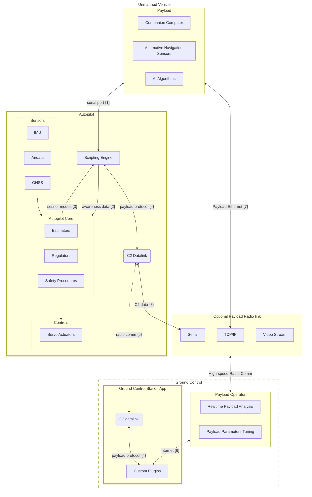

# Alternative Navigation Devices with APX Autopilot

The UAVOS APX Autopilot system supports integration with various third-party navigation modules, enabling flexible navigation and control capabilities. These external devices can enhance navigation with additional sensor data, assist in position estimation, and even act as the primary navigation source. They can also issue commands to the autopilot to perform specific maneuvers or navigate towards target locations, while the APX Autopilot retains control over safety protocols and core functions.

## System Architecture

The architecture separates responsibilities: the APX Autopilot manages core flight tasks—stabilization, maneuver execution, geofencing, safety protocols, and ground communications, while the third-party navigation module acts primarily as a sensor module. This module provides supplementary data that the APX Autopilot can use for enhanced situational awareness or specific maneuvers.

For example, an alternative navigation module (companion computer) can send high-level commands, such as hovering/loitering at a specific point or drifting with set XY velocities. The APX Autopilot interprets and executes these commands based on Ground Control Station (GCS) permissions and safety protocols, retaining full control over the aircraft’s dynamics and mission-critical functions to ensure reliability and safety.

## Command Interface: Navigation Module to Autopilot

The navigation module communicates with the APX Autopilot via a set of predefined commands defined in a user script uploaded to the APX Autopilot. These commands may include:

- **Maintain Heading**: Hold a specified heading.
- **Circular Path Following**: Follow a circular path with a defined center and radius.
- **Airspeed Control**: Set specific airspeed within safety limits.
- **Bank Angle Hold**: Maintain a fixed bank angle, such as a specific roll.
- **Line Path Following**: Follow a linear path based on a point and azimuth.

This fundamental command set can be extended to meet unique operational needs. All commands adhere to safety protocols managed by the APX Autopilot and GCS operator. The onboard scripting engine also allows custom control loops to run at AHRS loop frequency (>100Hz), enabling more complex navigation algorithms to be implemented and executed flexibly.

### Safety and Direct Control Limitations

APX Autopilot’s safety features prevent the navigation module from directly accessing control surfaces or flight dynamics. Direct rate control (e.g., roll, pitch, yaw) is generally discouraged for safety reasons, as it may destabilize the flight. While possible, this configuration requires careful consideration and thorough testing to ensure safe operation.

### Autopilot Commands to Navigation Module

The APX Autopilot can also send specific requests to the navigation module, fostering collaborative situational awareness and dynamic mission adaptation. For example, if a visual navigation AI is assisting in finding a landing spot, the APX Autopilot may request the navigation module to search for a suitable landing area within a designated sector or radius, with the navigation module processing the request and reporting back.

This bidirectional communication creates a cohesive framework in which the APX Autopilot and navigation module work in tandem, each leveraging their specialized capabilities for optimized navigation and control.

### Concept Summary

This integration design isolates navigation tasks from core control and safety functions managed by the APX Autopilot. Developers can focus on navigation capabilities without modifying established control algorithms or safety protocols. For instance, a bank angle hold command from the navigation module is subject to geofencing, safety protocols, and GCS approvals before the APX Autopilot adjusts the aircraft’s bank angle.

By integrating alternative navigation devices in this way, APX Autopilot enhances mission versatility and adaptability while preserving the autonomy and safety of the core flight control system.

## Communication Interfaces

The APX Autopilot hardware provides flexible communication interfaces for integrating alternative navigation devices, primarily using serial connections like UART or RS232. These interfaces enable seamless data exchange between the APX Autopilot and the companion computer. The onboard scripting engine processes incoming commands and data, handling protocol logic to support real-time navigation updates and control adjustments.

### Data Exchange with Ground Control Software

The APX Autopilot interfaces with the Ground Control Software (GCS) to receive mission updates, flight plans, and safety commands. The external navigation module can also transmit data to the GCS for real-time monitoring and enhanced situational awareness. When needed, the autopilot manages data delivery between the companion computer and ground station via its existing C2 datalink.

This bidirectional communication ensures that all operators have access to up-to-date information, supporting informed decision-making based on the aircraft’s status and mission progress.

The diagram above illustrates the communication flow between the APX Autopilot, companion computer, and Ground Control Station (GCS):

1. The APX Autopilot receives commands and data from the companion computer via a serial connection, with protocol logic defined in the onboard scripting engine.
2. The scripting engine processes awareness data from the companion computer, updating the autopilot’s navigation and control logic.
3. Based on safety protocols and GCS operator commands, the script can adjust the companion computer’s modes and issue commands, implemented by the onboard scripting engine by the user.
4. The APX Autopilot manages data exchange between the companion computer and GCS, packing and sending data to the GCS via script, where it’s processed by a GCS plugin and forwarded to the payload operator over an internet connection.
5. The APX Autopilot communicates with the GCS over the C2 radio link, transmitting mission updates, telemetry, and safety commands. Payload data packed by the script is also sent via this link.
6. The GCS forwards payload data to the payload operator over an internet connection, enabling real-time payload analysis and parameter tuning. The protocol is defined by the user in the plugin itself, but it is limited by the data sent by the onboard script. Also the plugin can send commands to the onboard script and provide additional data to the payload operator from decoded APX Autopilot telemetry stream.
7. Optionally, the payload operator can connect directly to the payload computer via a high-speed radio link, providing access to payload data and controls.
8. C2 data can be redundantly forwarded to the Ground Control Station via the Optional Payload Radio Link to enhance safety and data integrity. For specific mission requirements, the standard C2 radio link can be omitted in favor of the Optional Payload Radio Link. In this setup, the payload data link must support dual interfaces: a serial connection to the APX Autopilot and an Ethernet connection to the companion computer.
