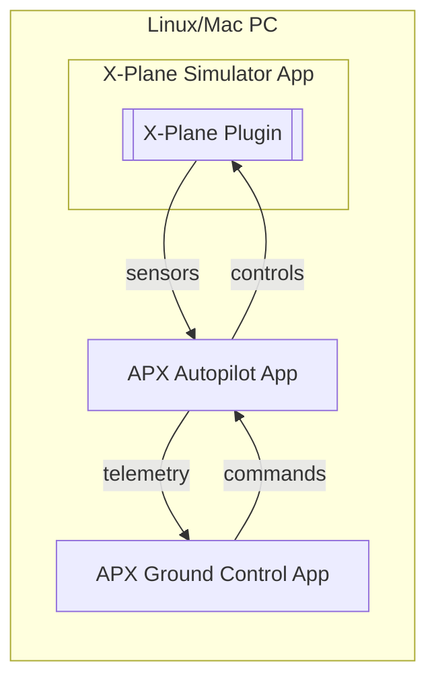
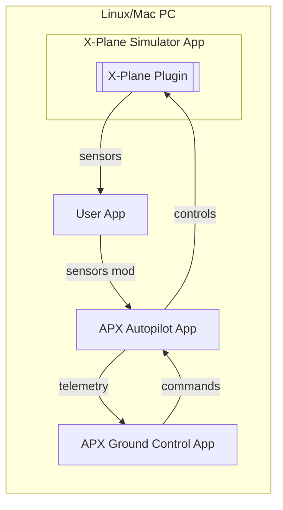
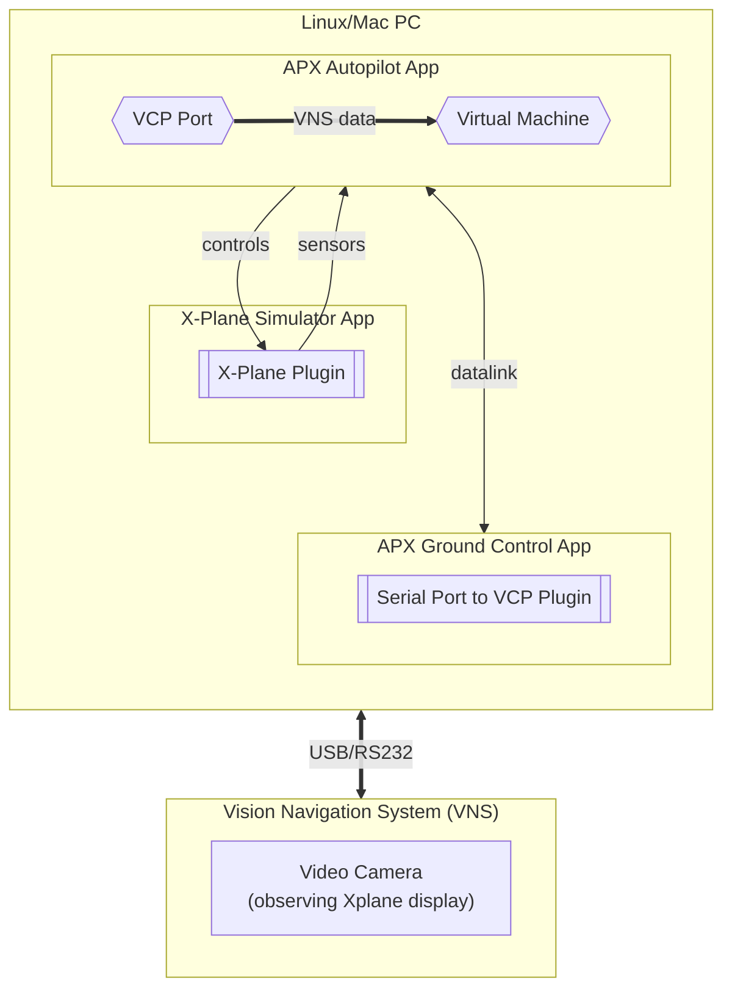

# APX Simulation Flows

This article describes the simulation flows of the APX system. The simulation is based on the [X-Plane](https://www.x-plane.com/) flight simulator. The simulator is launched on the same PC as the autopilot, but can also be launched on a separate machine when needed.

The simulator sends data to the autopilot (`sensors`) and receives data from the autopilot (`controls`). All communications between the simulator and the autopilot are performed via UDP sockets. The simulated autopilot also use UDP sockets for the data-link with the GCS (`telemetry` and `commands`).

The data is sent in binary format, which is defined in the corresponding source code files. Usually, the data is sent in the form of a structure, which is defined in the corresponding header file. The stream is also wrapped in [COBS](https://github.com/uavos/apx-lib/tree/main/xbus/serial) serial format for packetization and error detection.

The following scenarios are provided as examples and are not limited to them. The user can create other scenarios by modifying the source code of the GCS or developing custom plugins or stand-alone applications which interact with the autopilot, GCS or some other simulator via UDP sockets. The whole data structures and protocols used in the APX system are open and published in the [apx-lib](https://github.com/uavos/apx-lib) and [apx-gcs](https://github.com/uavos/apx-gcs) repositories.

## Simple SIL simulation

This simulation is the simplest and does not require any additional hardware. The autopilot (APX) and the simulator (X-Plane) are launched on the same PC. The simulator sends data to the autopilot (`sensors`) and receives data from the autopilot (`controls`).

The `APX Autopilot App` on the PC simulates the behavior of the autopilot and precisely reflects the behavior of the real autopilot. This application is part of the `APX Ground Control App` and is launched automatically when the simulation is launched from the GCS menu. Although the application is part of the GCS, it does not require a graphical interface and can be launched in the background from the command line.

- `sensors` - data from the simulator (X-Plane) to the autopilot (APX), the data structure and the principle of operation are illustrated in the [xplane plugin source](https://github.com/uavos/apx-gcs/blob/main/src/Plugins/System/Simulator/xplane/plugin.cpp);
- `controls` - data from the autopilot (APX) to the simulator (X-Plane);
- `telemetry` and `commands` - data-link from the autopilot (APX) to the GCS (APX). Exactly the same stream is transferred over the radio channel to the real UAV. The telemetry format is published [here](https://github.com/uavos/apx-lib/tree/main/xbus/telemetry).

## SIL simulation with data modifications

For this simulation, the user application is used, which is launched on the same PC as the autopilot. The user application receives UDP datagrams from the simulator, modifies it, and sends it to the autopilot (`sensors mod`).

The user application must be able to deal with the binary data format, which is illustrated in the [xplane plugin source](https://github.com/uavos/apx-gcs/blob/main/src/Plugins/System/Simulator/xplane/plugin.cpp).

## HIL simulation with external sensors

External physical sensor is connected to PC machine via USB/RS232 serial port. F.ex. a Vision Navigation System (VNS) which observes the screen of simulated 3D world, generated by X-plane, to get velocity vector or global position estimate.

The sensor data is sent to the autopilot via the virtual serial port. The GCS [Serial Port to VCP Plugin](https://github.com/uavos/apx-gcs/tree/main/src/Plugins/Tools/PortForwarding) is used to forward physical serial port on the PC to the [VCP port](https://docs.uavos.com/fw/ports_vcp) of the autopilot.

The autopilot runs user script in its [Virtual Machine engine](https://docs.uavos.com/fw/script) to process sensor data from the VCP port (managing specific protocol). The script then provides fixes for the decoded sensor data to the autopilot via internal API.

The behavior of the Virtual Machine of the autopilot and the VCP data processing is simulated by the `APX Autopilot App` on the PC and precisely reflects the behavior of the real autopilot. This also allows to debug the user script on the PC without the need to upload it to the autopilot hardware. The user script task is to decode the external sensor protocol, extract the sensor data and provide fixes for the autopilot.

The script can also provide some extra data to the VNS via the same VCP port channel. F.ex. the current attitude of the UAV can be updated, so that VNS sensor can improve its position estimate.

